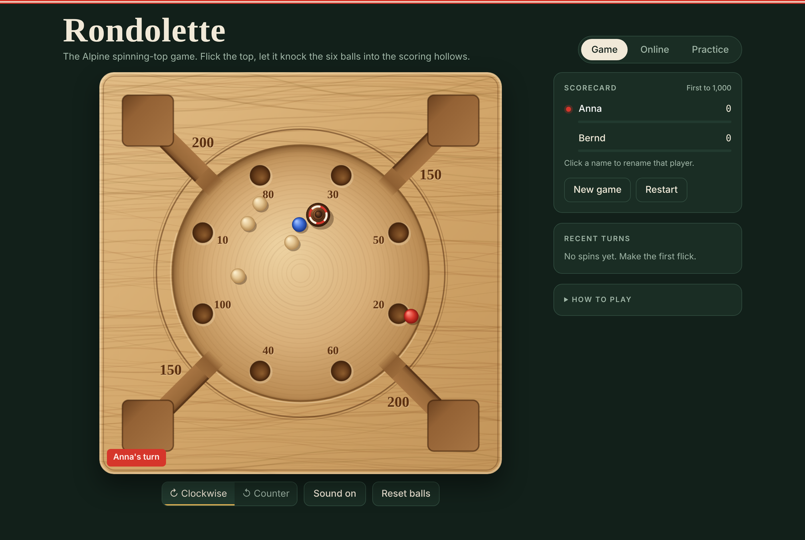
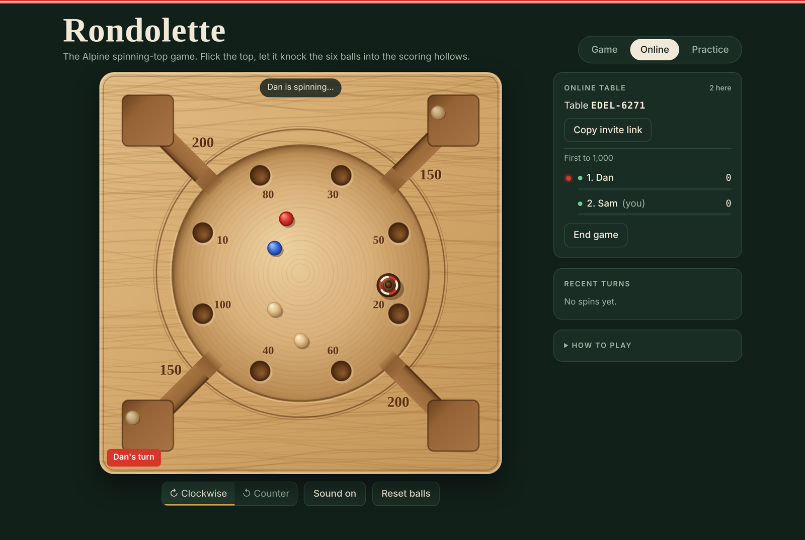
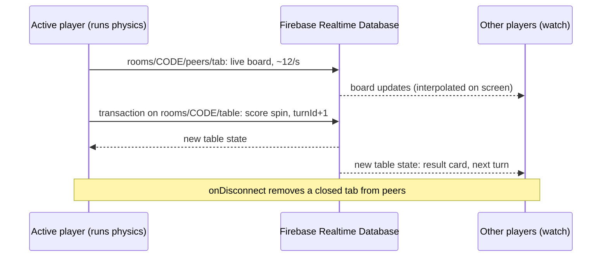

# Rondolette

A browser version of **Tiroler Roulette** (Tyrolean roulette), the Alpine wooden
spinning-top game. You flick a top into a carved bowl; it wanders, knocks six
wooden balls around, and whatever settles in the scoring hollows counts. Up to
six players can share one screen or play together online from anywhere.

It's a single, dependency-free HTML file: a hand-written 2D physics engine on
Canvas, synthesized sound, and real-time multiplayer over Firebase.



## Highlights

- **Custom physics engine.** No physics library. Fixed sub-stepping
  (8 steps per frame), a sloped bowl that pulls balls back to the middle,
  rolling friction and drag, elastic ball-to-ball collisions, and recessed
  hollows that act as wells: a ball crossing one dips toward its centre and
  drops in only if it's moving slowly enough.
- **A top that behaves like a top.** It carries real spin that decays over
  time, wanders on a smoothed random walk that grows as it slows, curves
  gyroscopically, grips the bowl wall, and finally topples and lies on its side.
  When it touches a ball, its spinning rim flings the ball sideways, which is
  what sends balls orbiting round the bowl.
- **Tuned with data, not guesswork.** A headless harness
  (`window.__tyrolTest(n)`) simulates hundreds of random spins and reports
  balls scored, points, collisions per spin and spin length. Each physics change
  was checked against those numbers alongside play-testing (see the
  [design notes](../../docs/rondolette/README.md)).
- **Real-time online multiplayer.** Create a table, send the invite link, and
  friends join from their own devices with no account. The active player's
  browser runs the physics and streams the board about 12 times a second;
  everyone else watches the same spin live with interpolation.
- **Consistent shared state.** Seats, scores and turns live in Firebase Realtime
  Database and are changed only inside transactions. Every turn carries a
  `turnId`, so a stale tab or double click can't score a spin twice. Players who
  drop out are detected through presence and can be skipped.
- **Everything is drawn in code.** The maple board, carved bowl, hollows,
  burned-in numbers and lacquered balls are procedurally rendered on Canvas;
  the clicks, drops and top hum are synthesized with the Web Audio API.



## How to play

- Press inside the bowl to set the top down, drag in the direction you want it
  to travel, and let go. A longer drag spins it faster.
- Each ball that settles in a hollow or rolls into a corner box scores that
  number. The **red** ball scores double; the **blue** ball's points are taken
  away. Score with all six in one spin and you go again.
- **First to a target** (500, 1,000 or 2,000): take turns and add up points.
- **Single spin-off:** one spin each, highest wins; ties spin again.
- **Practice:** free spins with stats and a hit chart per hollow.
- Optional **red rule:** a spin only counts if the red ball scores.

## How online play works



- `rooms/<CODE>/table` holds the game: seats, settings, scores, turn,
  recent log and the last result (including where the balls ended up, so late
  joiners see the final board).
- `rooms/<CODE>/peers/<tab>` holds who is here and, for the active player, the
  live board. It's removed automatically when a tab closes.
- Players sign in anonymously, and the [security rules](database.rules.json)
  allow signed-in clients to read and write game rooms only.

## Run it

```bash
cd apps/rondolette
python3 -m http.server 8000
# open http://localhost:8000
```

The Game and Practice tabs work offline. The Online tab uses the Firebase
project configured near the top of the script in `index.html`. To use your own:

1. Create a Firebase project and register a web app.
2. Turn on **Authentication → Anonymous**.
3. Create a **Realtime Database** in locked mode and publish
   [`database.rules.json`](database.rules.json).
4. Replace `FB_CONFIG` in `index.html` with your project's config.

To deploy, drop the `rondolette` folder onto Netlify (or any static host).

The Firebase web config, including its API key, is a public identifier rather
than a secret: access is controlled by the database rules and anonymous auth.

## Tech

Vanilla JavaScript · Canvas 2D · Web Audio API · Firebase Realtime Database and
Anonymous Auth (compat SDK 10.12.2) · static hosting on Netlify. No build step
and no framework.

## Credits

Built by [@dostover](https://github.com/dostover) with Claude as an AI pair programmer. Game rules are based
on the traditional Tiroler Roulette board; point values on the hollows are
this version's own.
